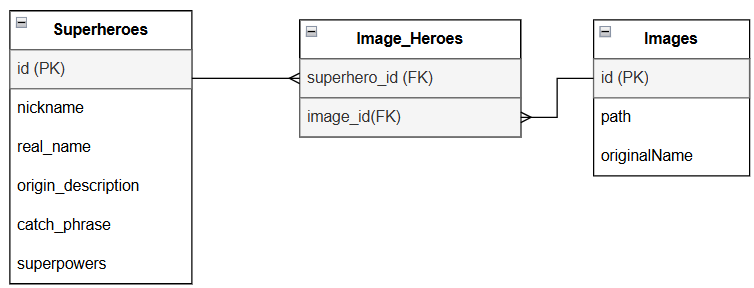

# Superhero Web Application

## Overview

This project is a web application designed for managing a superhero database. It allows users to create, edit, view, and
delete superhero profiles. Each profile includes detailed information and associated images.

## Features

- **CRUD Operations**: Create, read, update, and delete superhero entries.
- **Image Management**: Add or remove images for each superhero.
- **Pagination**: Display a list of superheroes, 5 items per page, showing one image and nickname.
- **Detailed View**: View all details and images of a selected superhero.

## Technologies Used

### Backend

- **Node.js** with **Nest.js**
- **Postgresql** for database management
- **Prisma** as the ORM

### Frontend

- **React** for building the user interface
- **React Router** for navigation
- **Axios** for HTTP requests

### Additional Tools

- **Multer** for image uploads

## Installation and Setup

### Prerequisites

- **Node.js** (version 14 or higher)
- **npm**
- **Postgresql** database

### Setup

1. Clone the repository:
   ```bash
   git clone https://github.com/yourusername/superhero-database.git
   cd superhero-database/backend
2. Install dependencies (it will install for front and backend):
   ```bash
   npm install
3. After configuring your .env file, run the following command to apply migrations:
   ```bash
   npm run database:migrate
4. Run Backend:
   ```bash
   npm run start:back
5. Run Frontend:
   ```bash
   npm run start:front 
   ```

## Environment Configuration

Ensure that you have created `.env` files for both the frontend and backend to properly configure the environment
variables.

### .env for Frontend

Create a `.env` file in the `front` directory with the following content:

| Name            | Description                                                     | Example Value             |
|-----------------|-----------------------------------------------------------------|---------------------------|
| `VITE_BACK_URL` | The base URL for API requests from the frontend to the backend. | `"http://localhost:3000"` |

### .env for Backend

Create a `.env` file in the `backend` directory with the following content:

| Name           | Description                                    | Example Value                                                   |
|----------------|------------------------------------------------|-----------------------------------------------------------------|
| `DATABASE_URL` | Connection string for the PostgreSQL database. | `"postgresql://<username>:<password>@<host>:<port>/<database>"` |

## API Requests

This section provides an overview of the API endpoints available in the application.

| Method | Endpoint             | Description                              |
|--------|----------------------|------------------------------------------|
| POST   | /superheroes         | Create a new superhero                   |
| POST   | /superheroes/detail  | Create a new superhero with images       |
| GET    | /superheroes         | Retrieve a list of superheroes           |
| GET    | /superheroes/:id     | Retrieve details of a specific superhero |
| PATCH  | /superheroes/:id     | Update a specific superhero              |
| DELETE | /superheroes/:id     | Delete a specific superhero              |
| POST   | /image/superhero/:id | Upload images for a specific superhero   |
| DELETE | /image/:id           | Delete a specific image                  |

## Assumptions

1. User Roles: It is assumed that all users have the necessary permissions to perform CRUD operations on the superhero
   database.
2. Database Connection: The application assumes that a PostgreSQL database is properly set up and accessible, and the
   connection string in the .env file is correctly configured.
3. Image Storage: It is assumed that the file storage system for images (defined in the storage configuration) is
   functioning correctly, and the specified storage path exists.
4. API Stability: The API endpoints are assumed to remain stable and unchanged during development, and no breaking
   changes will occur in the external libraries used.
5. Browser Compatibility: It is assumed that the application will be used in modern browsers that support the features
   utilized in the frontend code.
6. Data Validation: It is assumed that input data is validated on the frontend before being sent to the backend,
   reducing the risk of invalid data being processed.
7. File Upload Limits: The application assumes that the maximum number of images per superhero (10 images).
8. Pagination: It is assumed that users will require pagination for the superhero list, with a default of 5 items per
   page.
9. Environment Variables: It is assumed that the user has knowledge of how to configure environment variables and
   understands the purpose of each variable listed in the .env files.
10. Development Setup: It is assumed that users have the required tools (Node.js, npm, PostgreSQL) installed and
    configured on their machines before attempting to run the application.

## UML Database Diagram

